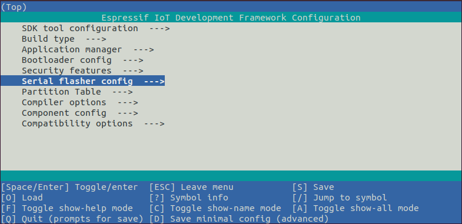
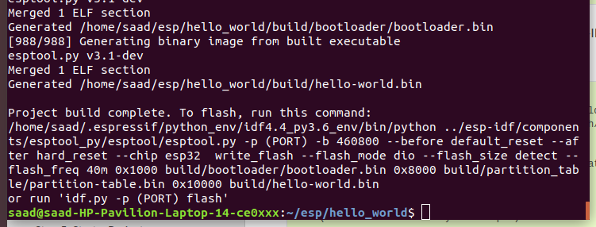

# Table Of Contents
* WALL-E Installations
    * [For Windows](#for-windows)
    * [For Linux](#for-linux)
* [Commands](#commands)
# For Windows
First We are going to install ESP-IDF First and then Wall-E files
## 1. Download the installer from ( https://docs.espressif.com/projects/esp-idf/en/latest/esp32/get-started/windows-setup.html#esp-idf-tools-installer )
<div style="text-align:center"></div>

## 2. After Downloading open .exe file, select `I accept` then click Next>.
<div style="text-align:center"></div>

## 3. In my case I already had python3.6 and github on my system. If you don’t, then select the install python, install git options 
<div style="text-align:center"></div>


## 4. 
<div style="text-align:center"></div>

## 5. 
<div style="text-align:center"></div>

## 6.
<div style="text-align:center"></div>

## 7. Click on Install then after Installation check all boxes and click on Finish.
<div style="text-align:center"></div>
<div style="text-align:center"></div>

## 8. ESP-IDF Command Prompt & Poweshell window will pop-up :
<div style="text-align:center"></div>
<div style="text-align:center"></div>
 
## 9. Run 'export.bat' in ESP-IDF Command Prompt:
<div style="text-align:center"></div>

## 10 . Run `idf.py build`
<div style="text-align:center"></div>
<div style="text-align:center"></div>

## Wall-E Files
## Step 1 : Cloning the Wall-E Git Repo
To clone the Repo just execute the following command on terminal
```sh
cd %userprofile%\esp
git clone https://github.com/SRA-VJTI/Wall-E_v2.2-beta.git
cd Wall-E_v2.2
git checkout dev
```
## Step 2 : Installation of SRA-Board Components
Insatalling SRA-Boarch Components in the Components folder
```sh
cd %userprofile%\esp\Wall-E_v2.2.beta/components
git clone https://github.com/SRA-VJTI/sra-board-component.git
```
# For Linux 
## Step 1 : Cloning the Wall-E Git Repo
To clone the Repo just execute the following command on terminal
```sh
git clone https://github.com/SRA-VJTI/Wall-E_v2.2-beta.git
cd Wall-E_v2.2-beta
git checkout dev
```
## Step 2 : Installing the Necessary Prerequisites(ESP-IDF etc)
Run the following commands for a quick install on Linux-based systems:
```sh
cd Wall-E_v2.2-beta
sudo chmod +x wall_e_install.sh
./wall_e_install.sh
```
After this, test the hello_world example in the same terminal; if it runs without any errors, log out & log back in.
```sh
cd ~/esp/esp-idf/examples/get-started/hello_world
idf.py flash monitor
```
## Step 3 : Installation of SRA-Board Components
Insatalling SRA-Boarch Components in the Components folder
```sh
cd Wall-E_v2.2.beta/components
git clone https://github.com/SRA-VJTI/sra-board-component.git
```
# Commands
This is the Basic Procedure For Compiling and Flashing a Project code on the ESP32
## Step 1 : Set Up Environtment variables
In the terminal where you are going to use ESP-IDF, run:
* For Linux
```sh
. $HOME/esp/esp-idf/export.sh
```
* For Windows
```sh
. $HOME/esp/esp-idf/export.sh
```
Through this command specify the Folder/Project in which we will to be using ESP-IDF 
## Step 2 : Start a Project
Now you are ready to prepare your application for ESP32.
```sh
cd %userprofile%\esp
xcopy /e /i %IDF_PATH%\examples\get-started\hello_world hello_world
```
## Step 3 : Connect Your Device
Now connect your ESP32 board to the computer and check under what serial port the board is visible.
Serial ports have the Name
* Starting with /dev/tty
## Step 4 : Configure
Now you are ready to prepare your application for ESP32.
```sh
cd ~/esp/hello_world #Navigating to the file
idf.py set-target esp32 # Commands for Setting the Target
idf.py menuconfig
```
If the previous steps have been done correctly, the following menu appears :
<div style="text-align:center"></div>

* This menu helps us to change the Parameters
## Step 5 : Build the Project
Build the project by running:
```sh
idf.py build #Command for building the code
```
This command will compile the application and all ESP-IDF components, then it will generate the bootloader, partition table, and application binaries.
<div style="text-align:center"></div>

## Step 6 : Flash onto the Device
Flash the binaries that you just built (bootloader.bin, partition-table.bin and hello-world.bin) onto your ESP32 board by running.:
* Note : Press Down the Boot Button on ESP32 and then execute the Flash command
```sh
idf.py -p PORT [-b BAUD] flash 
```
* Example Port - /dev/ttyUSB0 
* (Depending on the port you used for connecting the board the port can vary from /dev/ttyUSB0 and Zero can be replaced by any other consecutive number)


